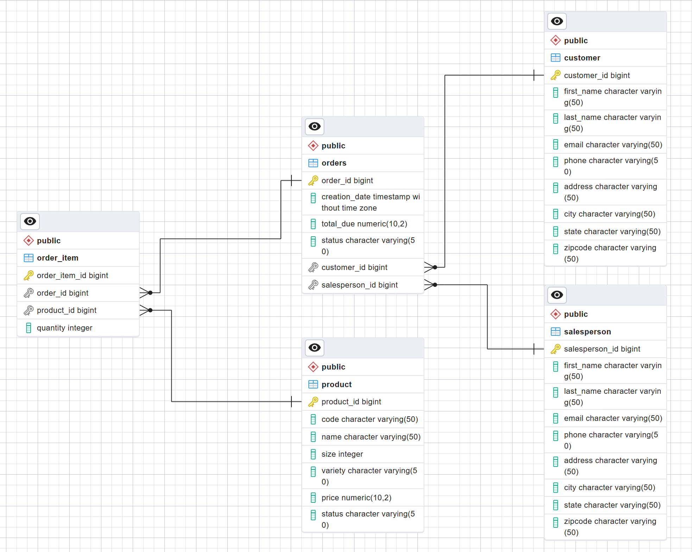

# Introduction

The purpose of this application is to establish a connection with a PostgreSQL relational database system using the Java Database Connectivity (JDBC) API and execute SQL statements to manipulate the data in the database. The application is developed as a maven project that includes the PostgreSQL JDBC driver as a dependency in the pom.xml file. This dependency enables the application to communicate with a PostgreSQL server that is running inside a docker container on the same machine.

# Implementaiton

## ER Diagram
The PostgreSQL database for this project has five tables and is populated with some sample data. The ER Diagrome below shows the relations between these different entities.

## Design Patterns
The project adopts the Object DAO pattern to decouple the business logic from the data access layer. This pattern allows the creation of data access objects (DAOs) that encapsulate the logic for accessing data from different sources. For illustrative purposes, the project implements a DAO for the Customer entity, which represents a table in the database. For simplicity, the DAO only exposes one field from the Customer table in its implementation. IN this special case, the Customer DAO can also be classified as a repository, since it provides an abstraction over a single table. Unlike repositories, DAOs can perform queries that involve multiple tables using join statements.

# Test
The app undergoes three different stages of testing. The first stage involves verifying the validity of the sample data by executing query statements on the database using psql commands. The second stage involves testing the connectivity between the Java app and the PostgreSQL server using JDBC. The third and final stage involves performing test CRUD operations on implemented DAO objects to confirm the correctness of the solution.