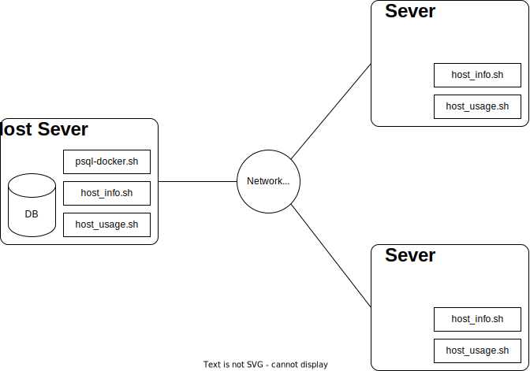

# Linux Cluster Monitoring Agent
This project monitors the hardware resource usage of a cluster of servers running the Linux operating system.
# Introduction
This project collects hardware information, such as CPU, memory, and IO specifications, as well as hardware resource usage, such as available memory, CPU idle percentage, and available disk space from a cluster of servers and stores this information in a Postgresql database. This information helps a Linux Cluster Administration (LCA) team decide whether to provision new hardware or make more educated resource usage decisions, especially during peak hours.

# Quick Start
Follow these steps to run this project on a Linux operating system. This project is built for CentOS 7; hence minor tweaks might be required for it to run on other flavours of Linux.
- Install Docker through the official docker website: `https://docs.docker.com/engine/install`
- Run `scripts/psql_docker.sh create USERNAME PASSWORD`   where `USERNAME` and `PASSWORD` are the username and password for a containerized Postgresql server.
  - Note: Elevated privileges might be necessary to run this command based on how the Docker daemon is installed on the Operating System. - If that is the case, please run the script prefixed with `sudo`.
- Run `docker ps` to make sure the `jrsv-psql` container is running.
- Install the psql client on your operating system to run the Postgresql commands `sudo yum install postgresql`
- To create the database tables used to store the host info and host usage data, run `psql -U USERNAME -h localhost -W -f sql/ddl.sql`. After hitting enter, please input `PASSWORD` value.
- Run `scripts/host_info.sh` only once as it stores hardware information about the host hardware, which rarely changes.
- Add the following line to the user crontab `crontab -e`: `* * * * * full/path/to/scripts/host_usage.sh &> /tmp/psql_docker.log`
- After a few minutes, check the log file at `/tmp/psql_docker.log` to ensure the `host_usage.sh` script is running every minute.
# Implementation
As the minimum viable product (MVP), the project is designed to run on a single machine. However, it can easily be expanded to multiple servers by choosing one server as the host server while all other servers send their usage information over the network to the host server. In the following subsections, we will discuss the solution's architecture, the scripts used and the modelling for the database.
## Architecture
The following image shows an example of a Linux cluster with three servers which are connected via a network switch. One of the servers is selected as the host server, where the database for storing the host info and host usage data is located. The host server directly stores its hardware info and usage in this database, while other servers connect through the network to keep this information in the host server. The host server also has the `psql_docker.sh` script, which is used to spin up the Postgres database container.

## Scripts
### `psql_docker.sh`
Firstly, the bash script `psql_docker.sh` is run to create or start a Postgres container. The script first runs the docker daemon if it is not already running.
```.sh
sudo systemctl status docker || sudo systemcyl start docker
```
Next, if the first argument to the script is `create`, then a new docker container built using the Postgres image is created.
```.sh
docker volume create pgdata
docker network create db
docker run --name jrvs-psql -e POSTGRES_PASSWORD="$db_password" -e POSTGRES_USER="$db_username" -d -v pgdata:/var/lib.postgresql/data -p 5432:5432 --network db postgres:9.6-alpine
```
If the first argument is `start` or `stop`, the script will start or stop the `jrvs-psql` container, respectively.
```.sh
docker container "$cmd" jrvs-psql
```
Where `$cmd` is a variable containing the first argument to the script.

### `host_info.sh`
The `host_info.sh` script requires five arguments which are:
1. The host address for the Postgres server: `psql_host`
2. The port address for the Postgres server: `psql_port`
3. The database name: `db_name`
4. Username for connecting to the database: `psql_user`
5. Password for connecting to the database: `psql_password`

Next, the script collects some information about the host hardware.
```.sh
table_value_search() {
  regex=$1; col=$2
  cat | grep -E "$regex" | awk -v col="$col" '{print $col}' | xargs
}
lscpu_out=$(lscpu)
vmstat_out=$(vmstat -s --unit K)
hostname=$(hostname -f)
cpu_number=$(echo "$lscpu_out" | table_value_search "^CPU\(s\):" 2) 
cpu_architecture=$(echo "$lscpu_out" | table_value_search  "^Architecture:" 2)
cpu_model=$(echo "$lscpu_out" | sed -nr "s/^Model name:\s*(.*)\s*/\1/p")
cpu_mhz=$(echo "$lscpu_out" | table_value_search "^CPU MHz:" 3)
l2_cache=$(echo "$lscpu_out" | table_value_search "^L2 cache:" 3 | sed "s/K//g" | sed "s/M/000/g")
total_mem=$(echo "$vmstat_out" | table_value_search "total memory" 1)
timestamp=$(date -u +"%Y-%m-%d %H:%M:%S")
```
Lastly, this information is stored in the database using the arguments passed to the script.
```.sh
insert_statement="INSERT INTO public.host_info\
(hostname, cpu_number, cpu_architecture, cpu_model, cpu_mhz, l2_cache, timestamp, total_mem) \
VALUES('$hostname', '$cpu_number', '$cpu_architecture', '$cpu_model', '$cpu_mhz', '$l2_cache', '$timestamp', '$total_mem')"

export PGPASSWORD=$psql_password
psql -h "$psql_host" -p "$psql_port" -d "$db_name" -U "$psql_user" -c "$insert_statement"
```

### `host_usage.sh`
Similar to `host_info.sh`, this script also requires the same five arguments:
1. The host address for the Postgres server: `psql_host`
2. The port address for the Postgres server: `psql_port`
3. The database name: `db_name`
4. Username for connecting to the database: `psql_user`
5. Password for connecting to the database: `psql_password`
However, it collects some usage data instead of collecting information about the hardware specs.
```.sh
# Usage info
column_value_picker() {
  col=$1; cat | awk -v col="$col" '{print $col}' | xargs
}
vmstat_out=$(vmstat --unit K)
hostname=$(hostname -f)
memory_free=$(echo "$vmstat_out" | tail -1 | column_value_picker 4)
cpu_idle=$(echo "$vmstat_out" | tail -1 | column_value_picker 15)
cpu_kernel=$(echo "$vmstat_out" | tail -1 | column_value_picker 14)
disk_io=$(echo "$vmstat_out" | tail -1 | column_value_picker 10)
disk_available=$(df -BM | grep "/dev/sda2" | column_value_picker 4 | sed "s/M//g")
timestamp=$(date -u +"%Y-%m-%d %H:%M:%S")
```
And similarly, it stores this information in the database using the arguments passed to the script.
```.sh
insert_statement="INSERT INTO host_usage\
(host_id, memory_free, cpu_idle, cpu_kernel, disk_io, disk_available, timestamp) \
VALUES('$host_id', '$memory_free', '$cpu_idle', '$cpu_kernel', '$disk_io', '$disk_available', '$timestamp')"

psql -U "$psql_user" -h "$psql_host" -p "$psql_port" -d "$db_name" -c "$insert_statement"
```

### `ddl.sql`
This SQL file is used to create `host_info` and `host_usage` tables in the Postgres server to store information generated in `host_info.sh` and `host_usage.sh` scripts, respectively. Before creating the mentioned tables, this script connects to the `host_agent` database with `\c host_agent`.
### Crontab
The following line is added to the user's `crontab` by running the command `crontab -e`:
```.sh
* * * * * full/path/to/scripts/host_usage.sh &> /tmp/psql_docker.log
```
The five stars represent *every* minute, hour, day of month, month, and day of the week in order from left to right. This line indicates that the given command should be executed for every minute of every hour or every day.

### `queries.sql`
This file contains some practice queries, which are explained in detail at [sql/README.md](./sql/README.md).

## Database Modeling
### `host_info`
Name | Type | constraints
--- | --- | ---
id | SERIAL (number) |  PRIMARY KEY, NOT NULL
hostname | VARCHAR |  UNIQUE, NOT NULL
cpu_number | INT2 |  NOT NULL
cpu_architecture | VARCHAR |  NOT NULL
cpu_model | VARCHAR |  NOT NULL
cpu_mhz | FLOAT8 |  NOT NULL
l2_cache | INT4 |  NOT NULL
timestamp | TIMESTAMP | NULL
total_mem | INT4 | NULL

### `host_usage`
Name | Type | constraints
--- | --- | ---
timestamp | TIMESTAMP | NOT NULL
host_id | SERIAL (number) | FOREIGN KEY(host_id.id), NOT NULL
memory_free | INT4 | NOT NULL
cpu_idle | INT2 | NOT NULL
cpu_kernel | INT2 | NOT NULL 
disk_io | INT4 | NOT NULL
disk_available | INT4 | NOT NULL
# Test
Each bash script was run with both expected and unexpected arguments. All scripts returned the expected results when they were run with the expected arguments. The scripts returned expected errors when run with a range of unexpected inputs.

Additionally, the scripts were run with different environment settings, such as when the docker daemon was running and stopped. 
# Deployment
The solution was deployed on a CentOS 7 Linux virtual machine. `crontab` was used for automation, where hardware resource usage was captured and stored in the Postgres server running in a docker container. The solution was run for several minutes, and the results were checked and verified in the tables inside the Postgres database.
# Improvements
- The current solution does not handle multiple servers which are connected to each other over a network. Using a socket, we can send server info and usage data to a host server, where this data is stored in the database.
- The current solution does not take into account the possibility of a change in hardware. To address this, a separate table, `hosts` can be made for storing non-changing host information such as host_id, while the `host_info` table will have a many-to-one relationship with `hosts` and can store multiple records for one host when hardware specifications change.
- Currently, the user has to follow a rather complicated number of steps to run the cluster monitoring agent on a new server. A new bash script can be added to automate some of these steps.
- The `psql_docker.sh` script returns a lot of redundant information in the `stdout`. Unimportant information can be directed to `/dev/null` to unclutter the output returned by the script. 